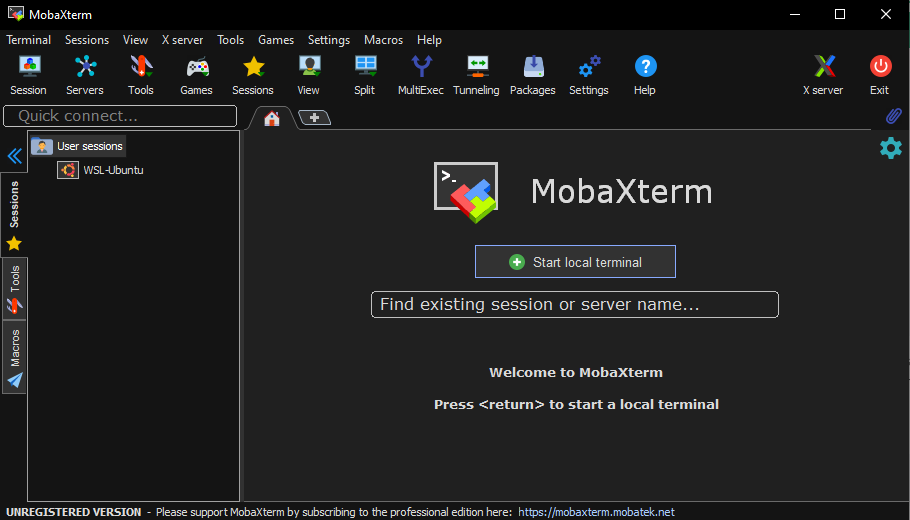
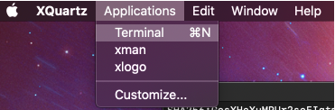
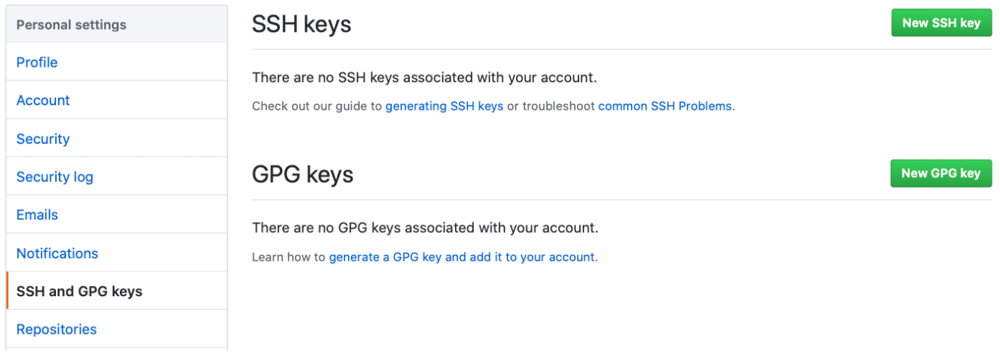
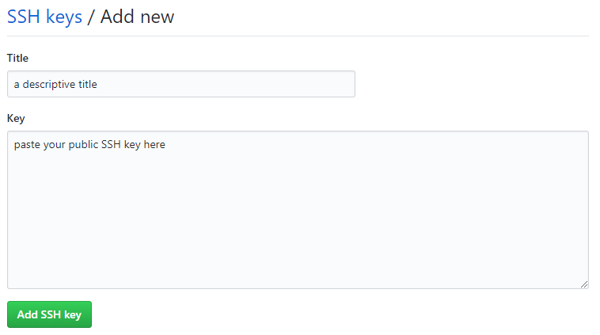
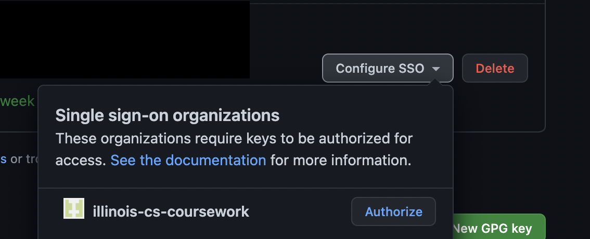

==========================
ECE 411: MP0 Documentation
==========================

-----------------
Environment Setup
-----------------

    The software programs described in this document are confidential and proprietary products of
    Synopsys Corp. or its licensors. The terms and conditions
    governing the sale and licensing of Synopsys products are set forth in written
    agreements between Synopsys Corp. and its customers. No representation or other
    affirmation of fact contained in this publication shall be deemed to be a warranty or give rise
    to any liability of Synopsys Corp. whatsoever. Images of software programs in use
    are assumed to be copyright and may not be reproduced.

    This document is for informational and instructional purposes only. The ECE 411 teaching staff
    reserves the right to make changes in specifications and other information contained in this
    publication without prior notice, and the reader should, in all cases, consult the teaching
    staff to determine whether any changes have been made.

.. contents:: Table of Contents
.. section-numbering::

-----

Introduction
============

Welcome to ECE 411! In this MP, you will set up your environment for the coming MPs this semester.
This document will go over how you can work on this course's MPs remotely by connecting to EWS.

Environment Setup
=================

You have two options for your remote work environment setup: Fastx or SSH (with X-Forwarding)
Once you are able to connect remotely to an EWS machine you can move on to the next section.

FastX is easy to set up, and generally performs better than X-Forwarding.
We recommend using FastX for remote work, and using X-Forwarding only if you face problems with FastX.

You can also use any EWS Linux laboratory on campus. 

FastX
-----

EWS has a remote X desktop set up for students. There are two ways to access FastX: either through a web
browser at fastx.ews.illinois.edu or by downloading a client and connecting to FastX through there. If you are choosing to
use FastX for your work environment, we recommend downloading the client as opposed to using the web browser. The
instructions and download for the client can be found `here <https://answers.uillinois.edu/illinois.engineering/81727>`_.
Students in the past have had issues with speed and crashes over FastX. We have worked over the summer to minimize
those issues, and please let staff know if you run into issues with FastX.

SSH (with X-Forwarding)
-----------------------

EWS has set up a couple of servers that students can access over SSH. You can reach these using your favorite
SSH client by connecting to EWS SSH server **linux.ews.illinois.edu**. More information about SSH could be found
`here <https://en.wikipedia.org/wiki/Secure_Shell>`_.

Most students have found that having a graphical Verdi waveform is useful. You may be the same,
in which case you can set up X-forwarding. Many SSH clients already include built-in local X server. Some SSH
clients, however, require installing and configuring local X server separately.

`Here <https://datacadamia.com/ssh/x11/cygwinx_remote_client>`_ is a good article on how to setup local X servers.
`Here <https://www.ssh.com/ssh/command/>`_ is the list of command line arguments for SSH.

If you are using X-forwarding, please turn on compression (option -C in command line) in SSH, as X-forwarding
requires huge amount of bandwidth for Verdi. In real practice, SSH compression can reduce a huge
fraction of bandwidth use (~300 Mbps to ~10 Mbps from our experiences). 

Here are some SSH clients and tools on Windows, for example:

- MobaXterm (SSH client with built-in X server)
- PuTTY (SSH client)
- SecureCRT (SSH client)
- Xming (X server)
- WinSCP (File management for FTP, SFTP, SSH)

Windows
~~~~~~~

On Windows, we recommend using MobaXterm, as installation is simple and it already includes a built-in X server. If you would
like to use MobaXterm as your SSH client, follow these instructions.

Navigate `here <https://mobaxterm.mobatek.net/download-home-edition.html>`_ and follow the instructions to download and
install MobaXterm.

After installation, open MobaXterm. You should see the following window:

.. _Figure 1:

   Figure 1: MobaXterm
   
You can start a local terminal by clicking **Start local terminal** or by clicking the **+** sign by the Home tab.
In this terminal you can connect to EWS with (replacing ``NETID`` with your NETID)::

    $ ssh -X -C NETID@linux.ews.illinois.edu

``-X`` enables X-forwarding and ``-C`` turns on compression for X-forwarding. You will be prompted for your password.
After that, you should be connected to EWS with X-forwarding enabled.

Mac
~~~

On Mac, we recommend using XQuartz. You can download and install Xquartz `here <https://www.xquartz.org/>`_.

Once installed, start the application XQuartz and open an xterm by selecting **Applications → Terminal**.

.. _Figure 2:

   Figure 2: XQuartz

Now, you can SSH into EWS by running (replacing ``NETID`` with your NETID)::
    
    $ ssh -Y -C NETID@linux.ews.illinois.edu
    
After this, you should be connected to EWS with X-forwarding enabled.

Creating a Github Repository
============================

To create your git repository, go to `<https://edu.cs.illinois.edu/create-gh-repo/fa22_ece411>`_.
The page will guide you through the setup of connecting your github.com account and your Illinois NETID.
You will need a github.com account in order to create the course repository. Please follow all the instructions on the link above.

Next, create a directory to contain your ECE 411 files (this will include subdirectories for each
MP, so chose a name such as ``ece411``) and execute the following commands (replacing ``NETID`` with
your NETID)::

  $ git init
  $ git remote add origin git@github.com:illinois-cs-coursework/fa22_ece411_NETID.git
  $ git remote add release git@github.com:illinois-cs-coursework/fa22_ece411_.release.git
  $ git pull origin main
  $ git branch -m main
  $ git fetch release
  $ git merge --allow-unrelated-histories release/mp0 -m "Merging provided MP0 files"
  $ git push --set-upstream origin main

If you have not set up SSH access to your github account, you may encounter an error similar to the following figure.

.. _Figure 3:
.. figure:: doc/figures/no_ssh.png
   :align: center
   :width: 80%
   :alt: Github SSH Error

   Figure 6: Github SSH Error

You can create a public key for your SSH client by running the following (where ``NETID`` is replaced by your NETID)::

    $ ssh-keygen -t rsa -b 4096 -C "NETID@illinois.edu"
    > Enter a file in which to save the key (~/.ssh/id_rsa): [press enter]
    > Enter passphrase (empty for no passphrase): [type passphrase]
    > Enter same passphrase again: [type same passphrase again]
    $ eval "$(ssh-agent -s)"
    $ ssh-add ~/.ssh/id_rsa

Print your public key to the terminal so you can copy it and add it to your Github::
    
    $ cat ~/.ssh/id_rsa.pub

Navigate `here <https://github.com/settings/keys>`_ and you should see the following web page:

.. _Figure 4:

   Figure 4: SSH and GPG keys
   
Select **New SSH Key** and type in a descriptive title. Paste your copied public key into the **key** field:

.. _Figure 5:

   Figure 5: Enter your new SSH key.

Click **Add SSH key** and type in your GitHub password if prompted. 

.. _Figure 6:

   Figure 6: Authorize Illinois coursework.

Click on configure SSO and authorize illinois-cs-coursework.

If you were successful, ``$ git fetch release`` should work.

Alternatively, you may download the ``_release/mp0/`` directory from Github and copy the files
manually to your repository.

Testing Your Software
=====================

To setup the software and environment variables for this class, run the following command

    $ source /class/ece411/ece411.sh 

You will need to run this command every time you log on to EWS. Alternatively you can add it to your bashrc

    $ echo 'source /class/ece411/ece411.sh' >> ~/.bashrc 

VCS
-------

We use Synopsys VCS to simulate our designs in this course. After cloning MP0 and setting up the class environment,
from the MP0 folder, run

    $ make sim/simv

This will invoke the Synopsys VCS compiler, build a simulation binary using the RTL design in /hdl and the testbench in /hvl
and run the simulation.

The simulation will dump all signals in a fast signal database (FSDB) file. 

Verdi
-------

Verdi is Synopsys's waveform viewer and debugger. We use it to inspect signals inside our design. 
To view the signal dump from the simulation that you just ran, 

    $ ./run_verdi.sh

.. _Figure 6:
.. figure:: doc/figures/verdi.png
   :align: center
   :width: 80%
   :alt: Verdi window.

You can navigate the design hierarchy on the instance window on the left. Double clicking on an instance opens up the block's code in the source browser window.
Select any signal name in the source browser window and press ``Ctrl + 4`` to add it to the waveform viewer.

While a signal is selected, you can click on the driver or load buttons on the toolbar to go to the source or destination of the selected signal.

A complete user guide to Verdi can be found on EWS 

    $ $VERDI_HOME/doc/verdi.pdf

Design Compiler
-------

Synopsys Design Compiler is an RTL synthesis tool. A synthesis tool converts an RTL circuit specification into logic gates and flip-flops. It uses pieces available 
in a standard cell library as building blocks. In ECE 411, we will use FreePDK45 as our target technology. 
In the real world, the PDK or Process Design Kit is usually supplied by a semiconductor fabrication company. 

The synthesis scripts have been set up for you. 

To synthesize the MP0 design, run

    $ make synth

Post synthesis, DC will output two reports: Area and Timing. 

The area report will be an estimate of how much physical space a design will occupy in square micrometers. 
The timing report will show the longest path delay in the design and whether it meets the timing requirement
imposed by the target clock frequency. (A clock period of 100 MHz means all signals from the output of one register must reach the input of another register in 10 ns)

The reports are stored in synth/area.rpt and synth/timing.rpt

Deliverables
=====================

There are no deliverables for this MP. However, it is essential that you go through the steps listed here
to setup your development environment and understand the tools being used.

We encourage you to look at the provided scripts and makefile and post any questions about the tools to Campuswire. 

Notes
=====

This document is written in reStructuredText (rst), a markup language similar to Markdown, developed
by the Python community. rst files are automatically rendered by Github, so you shouldn't need to
download or save anything to see the documentation.  However, if you would like an offline version
of the file, you may use the HTML version in the MP directory. Follow the steps below to generate
your own HTML or PDF version.

Install Python docutils if not already installed::

  $ sudo pip3 install docutils

Use a docutils frontend to convert rst to another format::

  $ rst2html5 README.rst MP0_spec.html
  $ rst2latex README.rst MP0_spec.tex

If creating a PDF using LaTeX, you will need a TeX distribution installed. You can then use::

  $ pdflatex MP0_spec.tex

Note that this document was optimized for viewing online in the Github repository. Generated HTML
files should match pretty closely to what you will see on Github, perhaps with different styles.
PDF documents will likely look different though, so use at your own risk.

See the `Docutils Front-End Tools`__ for more details.

__ http://docutils.sourceforge.net/docs/user/tools.html
