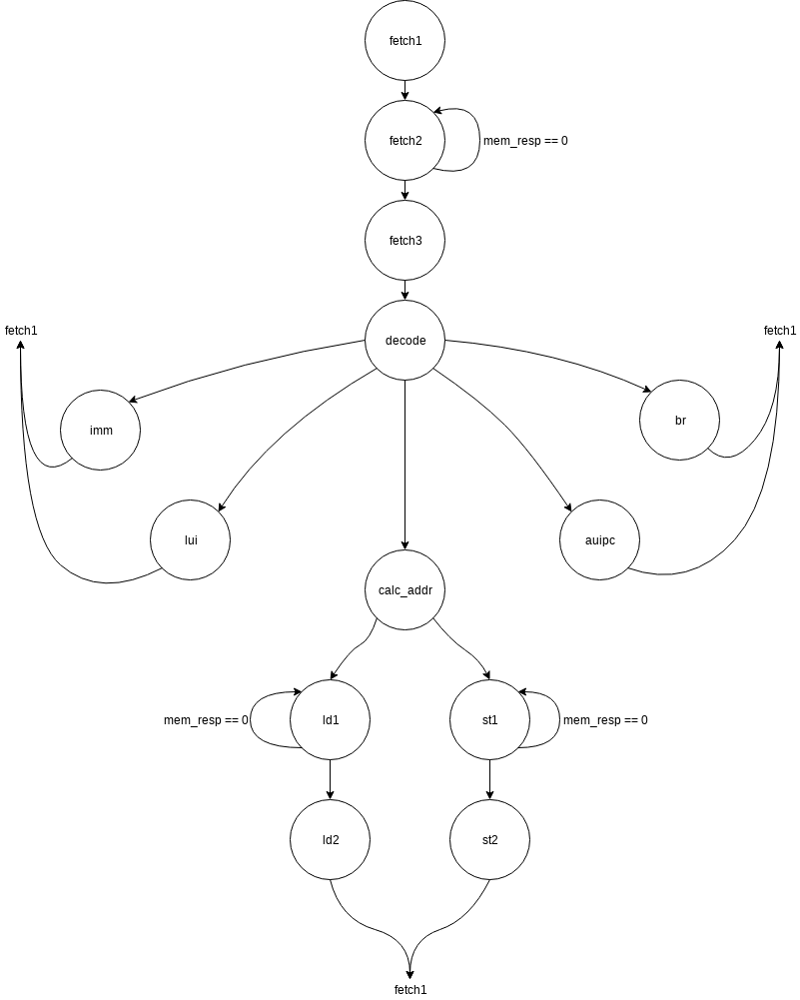

==========================
ECE 411: MP2 Documentation
==========================

---------------------------------------------
The RV32I Processor
---------------------------------------------

    The software programs described in this document are confidential and proprietary products of
    Synopsys Corp. or its licensors. The terms and conditions
    governing the sale and licensing of Synopsys products are set forth in written
    agreements between Synopsys Corp. and its customers. No representation or other
    affirmation of fact contained in this publication shall be deemed to be a warranty or give rise
    to any liability of Synopsys Corp. whatsoever. Images of software programs in use
    are assumed to be copyright and may not be reproduced.

    This document is for informational and instructional purposes only. The ECE 411 teaching staff
    reserves the right to make changes in specifications and other information contained in this
    publication without prior notice, and the reader should, in all cases, consult the teaching
    staff to determine whether any changes have been made.

.. contents:: Table of Contents
.. section-numbering::

-----

.. Aliases for appendix references
.. _Appendix A: `Appendix A: Loading programs into your design`_
.. _Appendix B: `Appendix B: RTL`_
.. _Appendix C: `Appendix C: CPU`_
.. _Appendix D: `Appendix D: Control`_
.. _Appendix E: `Appendix E: Datapath`_

Introduction
============

Congratulations, you made it through your first two ECE 411 Machine Problems! Now that you are familiar
with SystemVerilog design and verification, we will be moving on to study the RISC-V architecture.
In this MP we will step through the design entry and simulation of a simple, non-pipelined processor
that implements a subset of the RV32I instruction set architecture (ISA). This assignment (along
with material on the course web page) contains the specifications for the design. You will follow
the step-by-step directions to create the design and verify it using dynamic simulation.

The primary objective of this exercise is to give you a better understanding of multicycle micro-
architectures, and of the RV32I ISA. Additionally, you will learn how to use Synopsys Design Compiler software
to synthesize your design for an IC, and continue using VCS and Verdi to verify your design.
Since your next MPs will require original design effort, it is important for you to understand how
these tools work now so that you can avoid being bogged down with tool-related problems later.

The remainder of this section describes some notation that you will encounter throughout this
tutorial. Most of this notation should not be new to you; however, it will be worthwhile for you to
reacquaint yourself with it before proceeding to the tutorial itself. See `The RV32I Instruction Set
Architecture`_ for a brief description of the relevant instructions in the RV32I instruction set.
The `Design Specifications`_ and `Design Setup`_ section provide a high-level view of the design
See `Analysis and Functional Verification`_ for instructions on how to simulate your design using
VCS. The `Hand-ins`_ section contains the items you will need to submit for a grade, as well
as a breakdown of what is due for Checkpoint 1, and what is due for the Final hand-in. Also included
are several appendices that contain additional useful information.

As a final note, **read each and every word of the tutorial** and follow it very carefully. There
may be some small errors and typos. However, most problems that past students have had with this MP
came from missing a paragraph and omitting some key steps. Take your time and be thorough, as you
will need a functional MP2 design before working on future MPs.

Notation
--------
.. Much of this is probably redundant after MP0, and the typesetting stuff is more relevant to LaTeX
   than rst/html.  This should be updated later with more helpful/relevant details.

The numbering and notation conventions used in this document are described below:

- Bit 0 refers to the *least* significant bit.

- Numbers beginning with ``0x`` are hexadecimal.

- ``[address]`` means the contents of memory at location ``address``. For example, if
  ``MAR = 0x12``, then ``[MAR]`` would mean the contents of memory location ``0x12``.

- For RTL descriptions, ``pattern[x:y]`` identifies a bit field consisting of bits ``x`` through
  ``y`` of a larger binary pattern.  For example, ``X[15:12]`` identifies a field consisting of bits
  15, 14, 13, and 12 from the value ``X``.

- A macro instruction (or simply instruction) means an assembly-level or ISA level instruction.

- Commands to be typed on the terminal are shown as follows::

    $ command

  Do not type the dollar sign; this represents the prompt displayed by the shell (e.g.,
  ``[netid@linux-a2 ~]$``).

The RV32I Instruction Set Architecture
======================================

Overview
--------

For this project, you will be entering the SystemVerilog design of a non-pipelined implementation of
the RV32I instruction set architecture. Because RV32I is a relatively simple load-store ISA with a
robust toolchain published under GPL, it is a natural choice for our ECE 411 projects. The RISC-V
specification was created to be a free and open alternative to other popular ISAs and includes a 64
bit variant (and plans for 128 bit) and many extensions for atomic operations, floating point
arithmetic, compressed instructions, etc. For this MP, you will implement all of the RV32I
instructions with the exception of the ``FENCE*``, ``ECALL``, ``EBREAK``, and
``CSRR*`` instructions.

Instructions are fixed width and 32 bits in length, having a format where bits ``[6:0]`` contain the
opcode. The RV32I ISA is a *Load-Store* ISA, meaning data values must be brought into the General-
Purpose Register File before they can be operated upon. Each general-purpose register (GPR) is 32
bits in length, and there are 31 GPRs total, as well as the register ``x0`` which is hardwired as
constant ``0``.

The memory space of the RV32I consists of :math:`2^{32}` locations (meaning the RV32I has a 32-bit
address space) and each location contains 8 bits (meaning that the RV32I has byte addressability).

The RV32I program control is maintained by the Program Counter (PC). The PC is a 32-bit register
that contains the address of the current instruction being executed.

----

.. figure:: doc/figures/instr_formats.png
   :alt: encoding patterns for various RV32I instruction formats
   :align: center
   :width: 100%

   Figure 1: RV32I instruction formats

Detailed descriptions of all RV32-I instructions may be found in the `RISC-V specification`_.
Detailed encodings for each instruction can be found in the `instruction set listings`_ of the
above document.

.. _RISC-V specification: https://content.riscv.org/wp-content/uploads/2017/05/riscv-spec-v2.2.pdf#page=21
.. _instruction set listings: https://content.riscv.org/wp-content/uploads/2017/05/riscv-spec-v2.2.pdf#page=116

Memory Instructions
-------------------

Data movement instructions are used to transfer values between the register file and the memory
system. The load instruction (``LW``) reads a 32-bit value from the memory system and places it into
a general-purpose register. The store instruction (``SW``) takes a value from a general-purpose
register and writes it into the memory system.

The format of the ``LW`` instruction is shown below. The opcode (bits ``[6:0]``) is ``0000011``. The
effective address (the address of the memory location that is to be read) is specified by the ``rs1``
and ``imm[11:0]`` fields. The effective address is calculated by adding the contents of the ``rs1``
to the sign-extended ``imm[11:0]`` field.

.. figure:: doc/figures/instr_lw.png
   :alt: encoding of the load word instruction
   :align: center
   :width: 100%

The format of the ``SW`` instruction is shown below. The opcode of this instruction is ``0100011``.
As with the load instruction, the effective address is the memory location specified by the ``rs1``
and ``imm[11:0]``. The effective address is formed in the same manner as that of the ``LW`` except
that offset bits ``imm[4:0]`` come from the ``rd`` part of the instruction instead of the ``rs2``
portion. This is to ensure that the signals for selecting which register index to read or write are
not dependent on the instruction opcode.

.. figure:: doc/figures/instr_sw.png
   :alt: encoding of the store word instruction
   :align: center
   :width: 100%

Memory Instructions on Half Words and Bytes
~~~~~~~~~~~~~~~~~~~~~~~~~~~~~~~~~~~~~~~~~~~

The RV32I ISA defines several memory operations that operates on data that is smaller than a full word (4 bytes).
For half-words (2 bytes or 16 bits), the architecture will obtain only 16 bits from memory and load that into ``rd``.
For ``LH``, the architecture will load the 16 bits and sign extend the value before loading it into ``rd``. On the other hand,
for ``LHU``, the architecture will zero extend the 16 bit value. ``LB`` and ``LBU`` achieve the same purpose as ``LH`` and ``LHU``
but obtain only 8 bits from memory.

The question then becomes *which 8 or 16 bits from the 32 bit field of memory should the architecture obtain?*
You may notice that the main ``mp2`` module has a fixed width of 32 bits for both ``mem_rdata`` and ``mem_wdata``, which means
that the CPU and Memory can only communicate at a fixed length of 32 bits per memory operation. Then it should be up to the
CPU to handle the indexing of specific bytes (8 or 16 bits) based on the calculated memory address. Sending a byte or half-word
to memory should utilize the bit mask ``mem_byte_enable`` described on `Design Specifications`_. For more information, please
refer back to the `RISC-V Load-Store Specifications`_. You will  **not** have to complete these memory instructions on half words
and bytes for checkpoint 1, but you will need to implement these for the final checkpoint.

.. _RISC-V Load-Store Specifications: https://content.riscv.org/wp-content/uploads/2017/05/riscv-spec-v2.2.pdf#page=30

Arithmetic Instructions
-----------------------

RV32I has nine register-immediate integer instructions: ``ADDI``, ``SLTI``, ``SLTIU``, ``XORI``,
``ORI``, ``ANDI``, ``SLLI``, ``SRLI``, and ``SRAI``. These instructions represent addition, set less
than (signed) comparison, set less than unsigned comparison, bitwise exclusive disjunction, bitwise
disjunction, bitwise conjunction, logical left shift, logical right shift, and arithmetic right
shift, respectively. The encoding format for these instructions is shown below. Note that ``SRLI``
and ``SRAI`` share the same ``funct3`` code, so you must look at the ``funct7`` portion of the
instruction to determine which is which. ``SLTI`` and ``SLTIU`` will write a value of 1 or 0 to
``rd`` depending on if the comparison is ``true`` or ``false``, respectively. Each instruction
operates on ``rs1`` and the I-type immediate. For comparison and shift, ``rs1`` represents the left
side of the operator and the immediate represents the right side of the operator (the shift amount).

Additionally, RV32I has several `register-register integer computational instructions`__.
Make sure to implement the SUB instruction, since many students in the past seem to have
forgotten to implement that instruction.

.. __: https://content.riscv.org/wp-content/uploads/2017/05/riscv-spec-v2.2.pdf#page=27

Control Instructions
--------------------

The RV32I branch instructions, ``BEQ``, ``BNE``, ``BLT``, ``BGE``, ``BLTU``, ``BGEU``, cause program
control to branch to a specified address if the relationship between the first and second operand is
equal, not equal, less (signed), greater-or-equal (signed), less (unsigned), or greater-or-equal
(unsigned), respectively. When the branch is taken, the address of the next instruction to be
executed is calculated by adding the current PC value to the B-type immediate.

.. figure:: doc/figures/instr_control.png
   :alt: encoding of the conditional branching instructions
   :align: center
   :width: 100%

Additionally, RV32I supports two unconditional branching instructions which are used to create call
and return type operations, as well as implement function pointers.  These are the ``JAL`` and
``JALR`` instructions.  You do not need to implement these for Checkpoint 1, but will need them for
the final hand-in.

.. figure:: doc/figures/instr_jal.png
   :alt: encoding of the unconditional jump-and-link instructions
   :align: center
   :width: 100%

U-type Instructions
-------------------

The load upper immediate instruction, ``LUI``, puts a 20 bit immediate into the most significant
bits of the destination register, leaving the rest as zeros. Combined with ``ADDI``, you can place
any arbitrary 32 bit value into a RISC-V register. The add upper immediate PC instruction,
``AUIPC``, adds a 20 bit immediate (also padded with 12 zeros in the least significant bits) to the
PC and saves that value in the destination register.

.. figure:: doc/figures/instr_utype.png
   :alt: encoding of the U-type instructions
   :align: center
   :width: 100%

----

Note: the RISC-V specification defines several pseudo-instructions -- instructions which are
actually translated into one or more different instructions by the assembler.  These are important
to be aware of when writing test code, because some pseudo-instructions may be translated into
something you didn't excpect.  See `Table 20.2`__ in the RISC-V spec for details.

.. __: https://content.riscv.org/wp-content/uploads/2017/05/riscv-spec-v2.2.pdf#page=122

Design Specifications
=====================

Signals
-------

The microprocessor communicates with the outside world (e.g., the memory) through an address bus,
read and write data buses, four memory control signals, and a clock.

Top Level Signals
~~~~~~~~~~~~~~~~~

``clk``
  A clock signal -- all components of the design are active on the rising edge.

``rst``
  A synchronous reset signal -- sampled at the rising edge of clk. When asserted, the architectural
  state should go to initial state, including the controller state machine and all the registers.

``mem_address[31:0]``
  The memory system is accessed using this 32 bit signal. It specifies the address that is to be
  read or written.

``mem_rdata[31:0]``
  32-bit data bus for receiving data *from* the memory system.

``mem_wdata[31:0]``
  32-bit data bus for sending data *to* the memory system.

``mem_read``
  Active high signal that tells the memory system that the address is valid and the processor is
  trying to perform a memory read.

``mem_write``
  Active high signal that tells the memory system that the address is valid and the processor is
  trying to perform a memory write.

``mem_byte_enable[3:0]``
  A mask describing which byte(s) of memory should be written on a memory write. The behavior of
  this signal is summarized in the following table:

  =====================  ==========
   ``mem_byte_enable``    Behavior
  =====================  ==========
   ``4'b0000``            Don't write to memory even if ``mem_write`` becomes active
   ``4'b????``            Write only bytes specified in the mask (by a 1) when ``mem_write`` becomes
                          active
   ``4'b1111``            Write all bytes of a word to memory when ``mem_write`` becomes active
  =====================  ==========

``mem_resp``
  Active high signal generated by the memory system indicating that the memory has finished the
  requested operation.

Bus Control Logic
-----------------

The memory system is asynchronous, meaning that the processor waits for the memory to respond to a
request before completing the access cycle. In order to meet this constraint, inputs to the memory
subsystem must be held constant until the memory subsystem responds. In addition, outputs from the
memory subsystem should be latched if necessary.

The processor sets the ``mem_read`` control signal active (high) when it needs to read data from the
memory. The processor sets the ``mem_write`` signal active when it is writing to the memory (and sets
the ``mem_byte_enable`` mask appropriately). ``mem_read`` and ``mem_write`` must never be active at
the same time! The memory activates ``mem_resp`` when it has completed the read or write request.
We assume the memory response will always occur so the processor never has an infinite wait.

Controller
----------

There is a sequence of states that must be executed for every instruction. The controller contains
the logic that governs the movement between states and the actions in each state. In the RV32I, each
instruction will pass through the fetch and decode states, and once decoded, pass through any states
appropriate for the particular instruction. See `Appendix D`_ for a partial state diagram
of the controller.

Design Setup
============

The purpose of this MP, as stated before, is to become acquainted with the RV32I ISA and the related
software tools. You will be using VCS to simulate your design and Design Compiler to synthesize them for the remainder of the semester, 
so it is important that you understand how to use the tools.

To setup the class environment, from an EWS Linux machine, run::

  $ source /class/ece411/ece411.sh

To get the provided base code for MP2, from your ece411 MP directory, run::

  $ git fetch release
  $ git merge --allow-unrelated-histories release/mp2 -m "Merging MP2"

We also provide you several tools to help you interact with and test your design.  The most common
ones have been placed in the ``mp2/bin/`` directory, and are detailed below. 

- ``rv_load_memory.sh`` generates a ``memory.lst`` file from ``.asm`` test code for use in testbench
  memory. This program is part of the makefile and gets executed every time you compile your design.   

- ``compile.sh`` generates a RISC-V binary file suitable for simulating with ``spike``. This
  requires ``baremetal_link.ld`` to be present in the same directory. Use this to verify the correct
  results of test code on a verified solution.

Beginning the Design
--------------------

Some components for the RV32I Processor have been provided for you. You will create several missing
components, connect them together to form the datapath, and implement a controller to sequence the
machine. Take a look at the `Datapath Diagram`_ in `Appendix E`_ to get a feel for what components
are provided and what components need to be created.

Complete the Datapath
~~~~~~~~~~~~~~~~~~~~~

The given ``datapath.sv`` file contains a couple of already instantiated components and a partial port
declaration. You will need to create and instantiate additional components and declare additional
ports to complete the design.

Create the Controller
~~~~~~~~~~~~~~~~~~~~~

Next, we create the controller for the processor as a state machine in SystemVerilog. A skeleton
controller is given in ``control.sv`` which you can use to follow along in this section. The basic
structure for a state machine can be written in the following manner:

.. code:: verilog
   :number-lines:

   import rv32i_types::*; /* Import types defined in rv32i_types.sv */

   module control
   (
       /* Input and output port declarations */
   );

   enum int unsigned {
       /* List of states */
   } state, next_states;

   always_comb
   begin : state_actions
       /* Default output assignments */
       /* Actions for each state */
   end

   always_comb
   begin : next_state_logic
       /* Next state information and conditions (if any) for transitioning between states */
   end

   always_ff @(posedge clk)
   begin: next_state_assignment
       /* Assignment of next state on clock edge */
   end

   endmodule : control

Connect the Datapath and Controller
~~~~~~~~~~~~~~~~~~~~~~~~~~~~~~~~~~~

The ``mp2.sv`` file contains the top-level module. The hierarchy of the project can be viewed under
the **Hierarchy** tab. You need to connect the datapath and controller you just finished. To do
this, follow a similar method as you did to connect components within the datapath. Declare the
relevant internal signals and instantiate (and connect) the two modules. Finish the controller for
all instructions by following the design in `Appendix B`_, `Appendix C`_, and `Appendix D`_.  You
will have to figure out the design for several of the instructions, including the register-register
integer computational instructions. After adding an instruction, try compiling your design and
testing the newly added instruction.

Analysis and Functional Verification
====================================

After this, you will perform RTL simulation to verify the correctness of the
design. We recommend that you test your design after adding each instruction.

The main hvl file to use in simulation is ``mp2/hvl/top.sv``. This file does several things:

- it instantiates your MP2 design as the DUT;
- it instantiates one of two testbenches which provide input stimulus to the DUT;
- it instantiates an interface between itself, the testbench, the DUT, and memory, and generates a
  clock;
- it provides several halting conditions for your simulation;
- it instantiates a ``riscv_formal_monitor_rv32i``, which monitors the output as well as some of the
  internal state of the DUT and reports an error when the DUT outputs an incorrect value or enters
  an incorrect state. See `RISC-V Formal Verification Framework`__ for more details.

.. __: https://github.com/SymbioticEDA/riscv-formal

Two different testbenches are provided. To choose which one to instantiate in ``mp2/hvl/top.sv``,
set the ``TESTBENCH`` macro to either ``SRC`` or ``RAND``.

The ``SRC`` testbench drives the DUT by loading a program binary into memory, and executing the
program. This testbench should largely remain unchanged, instead modify the tests by modifying the
compiled program. We suggest using this testbench to execute simulations which use large amounts of
branches and jumps.

The memory model is provided as a behavioral SystemVerilog file ``memory.sv``. The model reads
memory contents from the ``memory.lst`` file in the ``sim`` directory of your
MP2 project. See `Appendix A`_ for instructions on compiling RISC-V programs and loading them
into memory.

The ``RAND`` testbench drives the DUT by executing a sequence of randomly generated instructions.
This testbench can and should be modified, as we have only provided the code to test load-store instructions.
We suggest extending this testbench to support simulation of randomly
generated immediate arithmetic, register-register instructions. While using the RAND testbench, it is not necessary to supply the ASM argument to make

Testbench Memory Initialization
-------------------------------

See `Appendix A`_ for how to load an assembly program into the design. Use the instructions to load
the given test code in ``mp2/testcode/riscv_mp2test.s``.

RTL Simulation
--------------

To run the RTL simulation, from your MP2 directory, :

.. code::

   make sim/simv ASM=PATH_TO_TESTCODE

This will compile your design and run the simulation. Pay attention to any compiler warnings.
The simulation will print any mismatches detected by the ``riscv_formal_monitor_rv32i``. Expected values will be prefixed with ``spec``.

Wave Traces
--------------

To aid in debugging, we will use Synopsys verdi. Once a simulation is run, it will dump all signals in the design in a .fsdb (Fast Signal Database) file. 
Launch Verdi by running 

.. code::

   ./run_verdi.sh &

Navigate to your design in the instance navigator window on the left. You will see the corresponding source code in the source window.
You can select any signal and press ``Ctrl + 4`` to add them to the waveform viewer window.

While trying to debug, you may want to edit the source code, run a simulation and observe the same set of signals. You can edit your code, and run make sim/simv,
while verdi is running. Once the simulation has finished, press ``Shift + l`` while the verdi window is active to reload the design. You can now view the waves
corresponding to the new simulation.

Additionally, you can save a "signal" file that instructs Verdi to load a set of signals in the waveform viewer. Once you have a set of signals added to 
the waveform viewer, select the nWave window, and press ``Shift + S`` to save the file.

Next time you launch Verdi, you can restore the signals by selecting the nWave window and pressing ``r``, and selecting the file that you saved earlier.
We recommend that you refer to the full Verdi user guide. Verdi has numerous debug features that can help improve productivity. 

.. code::
    evince $VERDI_HOME/doc/VerdiTut.pdf

Testing Your Design
~~~~~~~~~~~~~~~~~~~

With the above tools, you should be able to verify the functionality of your design. You can use the
RV32I simulator (``spike``) to run any test code to determine the correct behavior for the code and
see if the operation of your design matches the expected behavior. You should write your own test
code in RISCV assembly to test corner cases that might occur in your design and load it into memory
as described in `Appendix A`_.

Synthesis
===============

We synthesize the design using Synopsys Design Compiler. To synthesize your design, run 

.. code::
   
   make synth 

If your design is successfully synthesized, this will produce an area report and a timing report.
We target a 100 Mhz clock. Given the gate delays in the 45Nm node we are targeting, this is NOT an aggressive target and you should be able to 
meet timing constraints easily. 

The timing report will list the longest path delay in your design. If you see a positive slack value for the longest path, that means your design passes timing.
If there is a negative value, that means that particular path takes longer than 10 ns to propagate. The report will also list the gates in the pathway that will indicate
where the long piece of logic exists.

The second lab for MP2 will cover more information on design compiler and its gui, design vision. 

For full credit on this MP, your design must successfully synthesize and meet all timing constraints. There is no area constraint.
Note that this is only a requirement for the final checkpoint. 

Hand-ins
========

Checkpoint 1
------------

For CP1, you must submit a design with

- **register-immediate** instructions;
- load word and store word memory instructions;
- all conditional branch operations (not ``JAL``, ``JALR``);
- both U-type instructions (``LUI``, ``AUIPC``).

Checkpoint 2 / Final
--------------------

The final hand in requires you to complete the design by adding all missing instructions (with the
exception of those listed as not implemented in the `Overview`_).

Grading
=======

Autograder
----------

The autograder will test your design in two ways. First it will run many small tests that each
target a very minimal amount of functionality but together they should cover nearly all
functionality. This is the best way for the autograder to give you as much partial credit as
possible for small bugs. The second method of testing will be a larger test code that will test that
your design can successfully run larger sequences of instructions. No partial credit will be given
for this larger test code but it will not test corner cases as thoroughly as the targeted tests.

Additionally, **certain tests may be withheld from you until the CP1 and Final due-dates**. This
means that you should not treat earlier autograding runs as your verification effort. **You must
verify your own design.**

Do **not** modify the following given design files, since they will be replaced by the autograder:
``alu.sv``, ``ir.sv``, ``pc_reg.sv``, ``regfile.sv``, ``register.sv``, ``rv32i_mux_types.sv``,
``rv32i_types.sv``.

Grading Rubric
--------------

====================  =====
**Item**              **%**
====================  =====
CP Targeted Tests     20
CP Longer Test        5
**CP Total**          25
Final Targeted Tests  50
Final Longer Test     15
Synthesis and Timing  10
**Total**             100
====================  =====

Appendix A: Loading programs into your design
=============================================

To load a program into your design, we need to generate a memory initialization file, *memory.lst*,
that is placed into the simulation directory *mp2/sim* The *rv_load_memory.sh* script located in the *mp2/bin*
directory and is used to do this.

The *rv_load_memory.sh* script takes a RISC-V assembly file as input, assembles it into a RISC-V
object file, and converts the object file into a suitable format for initializing the testbench
memory. The script assumes that your project directory structure is set up according to the
instructions in this document. If not, you'll need to edit the paths for the memory initialization
file and assembler at the top of the script. The default settings are shown below.

The rv_load_memory.sh file is part of the Makefile for your design and gets executed automatically every time you compile your design.
You need to set some important variables in the  rv_load_memory.sh program.

.. code::

   # Settings
   ECE411DIR={path to your ECE411 git repo}
   DEFAULT_TARGET=$ECE411DIR/mp2/sim/memory.lst
   ASSEMBLER=/class/ece411/software/riscv-tools/bin/riscv32-unknown-elf-gcc
   OBJCOPY=/class/ece411/software/riscv-tools/bin/riscv32-unknown-elf-objcopy
   OBJDUMP=/class/ece411/software/riscv-tools/bin/riscv32-unknown-elf-objdump
   ADDRESSABILITY=1

You can use the script directly to compile testcode as well. It is expected that you write your own extensive ASM tests.
The given testcode is by no means exhaustive.

If you do see a permission denied error you will have to change the permission settings by

.. code::

  chmod u+x rv_load_memory.sh

You will have to only do this once.

Appendix B: RTL
===============

The tables in this section cover the RTL for **most** of the controller states needed for the first
checkpoint (e.g., **not** including **register-register** instructions).  You will have to finish the
rest on your own.

.. These tables were originally generated in LaTeX.  ReStructuredText supports table markup which
   would be able to accommodate this information (namely, list-tables, which allow wrapped text),
   but these are unsupported by the GitHub parser.  For now, the original LaTeX source is preserved
   in the file ./doc/figures/rtl_tables.tex.  If modifications are necessary, use this document to
   regenerate the necessary images.

FETCH Process
-------------

.. image:: doc/figures/rtl_fetch.png
   :width: 90%
   :align: center

DECODE Process
--------------

.. image:: doc/figures/rtl_decode.png
   :width: 90%
   :align: center

SLTI Instruction
----------------

.. image:: doc/figures/rtl_slti.png
   :width: 90%
   :align: center

SLTIU Instruction
-----------------

.. image:: doc/figures/rtl_sltiu.png
   :width: 90%
   :align: center

SRAI Instruction
----------------

.. image:: doc/figures/rtl_srai.png
   :width: 90%
   :align: center

Other Immediate Instructions
----------------------------

.. image:: doc/figures/rtl_imm.png
   :width: 90%
   :align: center

BR Instruction
--------------

LW Instruction
--------------

SW Instruction
--------------

.. image:: doc/figures/rtl_sw.png
   :width: 90%
   :align: center

AUIPC Instruction
-----------------

.. image:: doc/figures/rtl_auipc.png
   :width: 90%
   :align: center

LUI Instruction
---------------

Appendix C: CPU
===============

Control to Datapath
-------------------

==================  ================================
**Name**            **Type**
==================  ================================
``load_pc``         ``logic``
``load_ir``         ``logic``
``load_regfile``    ``logic``
``load_mar``        ``logic``
``load_mdr``        ``logic``
``load_data_out``   ``logic``
``pcmux_sel``       ``pcmux::pcmux_sel_t``
``cmpop``           ``branch_funct3_t``
``alumux1_sel``     ``alumux::alumux1_sel_t``
``alumux2_sel``     ``alumux::alumux2_sel_t``
``regfilemux_sel``  ``regfilemux::regfilemux_sel_t``
``marmux_sel``      ``marmux::marmux_sel_t``
``cmpmux_sel``      ``cmpmux::cmpmux_sel_t``
``aluop``           ``alu_ops``
==================  ================================

Datapath to Control
-------------------

==========  ================
**Name**    **Type**
==========  ================
``opcode``  ``rv32i_opcode``
``funct3``  ``logic [2:0]``
``funct7``  ``logic [6:0]``
``br_en``   ``logic``
``rs1``     ``logic [4:0]``
``rs2``     ``logic [4:0]``
==========  ================

Control to Memory
-----------------

===================  ===============
**Name**             **Type**
===================  ===============
``mem_read``         ``logic``
``mem_write``        ``logic``
``mem_byte_enable``  ``logic [3:0]``
===================  ===============

Memory to Control
-----------------
============  =========
**Name**      **Type**
============  =========
``mem_resp``  ``logic``
============  =========

Datapath to Memory
------------------
===============  ==============
**Name**         **Type**
===============  ==============
``mem_address``  ``rv32i_word``
``mem_wdata``    ``rv32i_word``
===============  ==============

Memory to Datapath
------------------

===============  ==============
**Name**         **Type**
===============  ==============
``mem_rdata``    ``rv32i_word``
===============  ==============

Appendix D: Control
===================

Control Signals
---------------

===================  =======================
**Name**             **Default value**
===================  =======================
``load_pc``          ``1'b0``
``load_ir``          ``1'b0``
``load_regfile``     ``1'b0``
``load_mar``         ``1'b0``
``load_mdr``         ``1'b0``
``load_data_out``    ``1'b0``
``pcmux_sel``        ``pcmux::pc_plus4``
``cmpop``            ``funct3``
``alumux1_sel``      ``alumux::rs1_out``
``alumux2_sel``      ``alumux::i_imm``
``regfilemux_sel``   ``regfilemux::alu_out``
``marmux_sel``       ``marmux::pc_out``
``cmpmux_sel``       ``cmpmux::rs2_out``
``aluop``            ``funct3``
``mem_read``         ``1'b0``
``mem_write``        ``1'b0``
``mem_byte_enable``  ``4'b1111``
``rs1``              ``5'b0``
``rs2``              ``5'b0``
===================  =======================

Control Diagram
---------------

See `Appendix B`_ for control state actions.

   Figure 14: The RV32I control state diagram -- sufficient for **most** of checkpoint 1

Appendix E: Datapath
====================

Datapath Signals
----------------

==================  ====================  ================  ===========================================
**Name**            **Type**              **Origin**        **Destination**
==================  ====================  ================  ===========================================
``clk``             ``logic``             ``input port``    ``PC, IR, regfile, MAR, MDR, mem_data_out``
``load_pc``         ``logic``             ``control``       ``PC``
``load_ir``         ``logic``             ``control``       ``IR``
``load_regfile``    ``logic``             ``control``       ``regfile``
``load_mar``        ``logic``             ``control``       ``MAR``
``load_mdr``        ``logic``             ``control``       ``MDR``
``load_data_out``   ``logic``             ``control``       ``mem_data_out``
``pcmux_sel``       ``pcmux_sel_t``       ``control``       ``pcmux``
``alumux1_sel``     ``alumux1_sel_t``     ``control``       ``alumux1``
``alumux2_sel``     ``alumux2_sel_t``     ``control``       ``alumux2``
``regfilemux_sel``  ``regfilemux_sel_t``  ``control``       ``regfilemux``
``marmux_sel``      ``marmux_sel_t``      ``control``       ``marmux``
``cmpmux_sel``      ``logic``             ``control``       ``cmpmux``
``aluop``           ``alu_ops``           ``control``       ``ALU``
``cmpop``           ``branch_funct3_t``   ``control``       ``CMP``
``rs1``             ``rv32i_reg``         ``IR``            ``regfile, control``
``rs2``             ``rv32i_reg``         ``IR``            ``regfile, control``
``rd``              ``rv32i_reg``         ``IR``            ``regfile``
``rs1_out``         ``rv32i_word``        ``regfile``       ``alumux1, CMP``
``rs2_out``         ``rv32i_word``        ``regfile``       ``cmpmux, mem_data_out``
``i_imm``           ``rv32i_word``        ``IR``            ``alumux2, cmpmux``
``u_imm``           ``rv32i_word``        ``IR``            ``alumux2, regfilemux``
``b_imm``           ``rv32i_word``        ``IR``            ``alumux2``
``s_imm``           ``rv32i_word``        ``IR``            ``alumux2``
``pcmux_out``       ``rv32i_word``        ``pcmux``         ``PC``
``alumux1_out``     ``rv32i_word``        ``alumux1``       ``ALU``
``alumux2_out``     ``rv32i_word``        ``alumux2``       ``ALU``
``regfilemux_out``  ``rv32i_word``        ``regfilemux``    ``regfile``
``marmux_out``      ``rv32i_word``        ``marmux``        ``MAR``
``cmp_mux_out``     ``rv32i_word``        ``cmpmux``        ``CMP``
``alu_out``         ``rv32i_word``        ``ALU``           ``regfilemux, marmux, pcmux``
``pc_out``          ``rv32i_word``        ``PC``            ``pc_plus4, alumux1, marmux``
``pc_plus4_out``    ``rv32i_word``        ``pc_plus4``      ``pcmux``
``mdrreg_out``      ``rv32i_word``        ``MDR``           ``regfilemux, IR``
``mem_address``     ``rv32i_word``        ``MAR``           ``output port``
``mem_wdata``       ``rv32i_word``        ``mem_data_out``  ``output port``
``mem_rdata``       ``rv32i_word``        ``input port``    ``MDR``
``opcode``          ``rv32i_opcode``      ``IR``            ``control``
``funct3``          ``logic [2:0]``       ``IR``            ``control``
``funct7``          ``logic [6:0]``       ``IR``            ``control``
``br_en``           ``logic``             ``cmp``           ``control, regfilemux``
==================  ====================  ================  ===========================================

Datapath Diagram
----------------

   Figure 15: The RV32I datapath diagram -- sufficient for **most** of checkpoint 1

